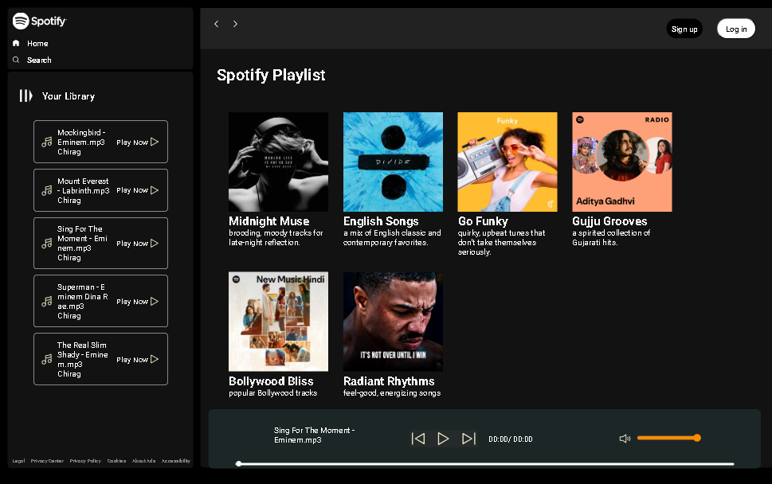

## 🎧 Spotify Web Clone
A responsive and interactive Spotify Web Clone built using HTML, CSS, and JavaScript. This project replicates the core features and design of the Spotify music streaming platform, allowing users to play songs, manage playlists, and enjoy a smooth, responsive user experience across all devices.

## 🚀 Features
🎵 Play/Pause functionality for songs

📃 Create and manage playlists

🖥️ Responsive layout for mobile, tablet, and desktop

🎨 Clean and modern UI styled with CSS

🧠 Code assistance via ChatGPT for logic and optimization

🔄 Dynamic updates and smooth transitions

## 🛠️ Tech Stack
<ul>
<li>HTML5 – Structure</li>

<li>CSS3 – Styling and layout</li>

<li>JavaScript – Functionality (playlists, music control)</li>

<li>Visual Studio Code – Code Editor</li>

<li>ChatGPT – For feature guidance and troubleshooting</li>
</ul>

## 🙌 Contribution Guidelines
If you're another GitHub user and want to use or improve this project:
<ul>  
<li>Fork this repository</li>

<li>Create a new branch: git checkout -b feature-name</li>

<li>Make your changes</li>

<li>Commit: git commit -m "Added new feature"</li>

<li>Push: git push origin feature-name</li>

<li>Create a pull request 🚀</li>
</ul>

📌 Notes
<ul>
<li>This project is for educational and personal learning purposes only.</li>

<li>All music and UI elements are either open-source or used as placeholders.</li>
  
<li>Feel free to customize, extend, or build on top of this project!</li>
</ul>

## 📸 Screenshot

## Video

https://github.com/user-attachments/assets/531c9a13-5121-4743-a312-9abaf083b6a5

